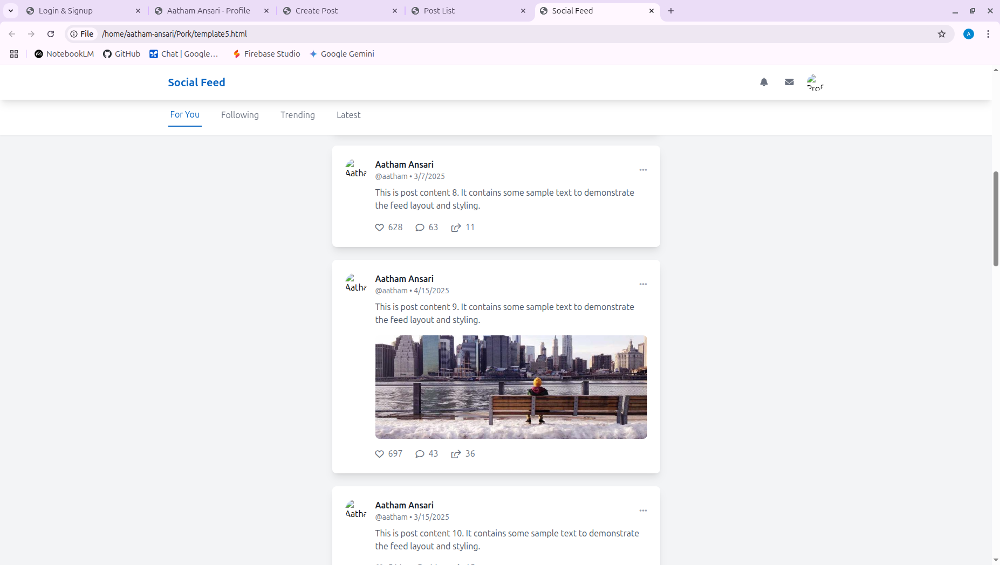
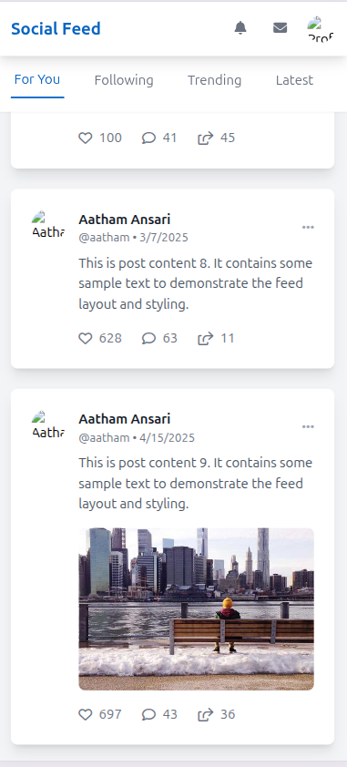

# Day 8: Basic Feed

## 🎯 Goal

Build the core feed structure and implement basic post display functionality with essential data management.

## 📚 Learning Outcomes

* Create responsive feed layout and structure.
* Implement basic post display components.
* Set up essential data management.
* Implement infinite scrolling.
* Handle basic loading and error states.
* Create smooth feed navigation.

## 🚀 Getting Started

Ensure your Day 7 First Deployment is complete and tested. You should understand React components and basic data fetching. The backend and frontend should be set up and running.

## 🛠️ Tasks

1.  **Create and Switch to a New Branch**
    > **IMPORTANT:** Always create a new branch for each distinct piece of work.

    ```bash
    # First, ensure you are on your 'main' branch and it's up-to-date
    git checkout main
    git pull origin main # Get any potential updates from your own fork's main

    # Now, create and switch to a new branch for this day's assignment/feature
    git checkout -b day-8-basic-feed
    ```

    > **What's happening?** You're creating an independent line of development for this day's tasks.

2.  **Set Up Development Environment**
    * **Backend Virtual Environment (if not already active from previous day):**
        ```bash
        cd backend
        source venv/bin/activate # On Windows use: venv\Scripts\activate
        ```
    * **Install Backend Dependencies:**
        ```bash
        pip install Flask Flask-SQLAlchemy Flask-Migrate
        ```
    * **Frontend (already set up from previous days):**
        * Ensure your `frontend` directory has all Node.js dependencies installed via `npm install`.

3.  **Feed Structure Implementation (Frontend)**
    * **Create Core Feed Components:**
        * Design the main feed container component.
        * Create a reusable post card component for displaying individual posts.
        * Implement basic feed navigation components.
        * Add components or logic for displaying loading states.
        * Set up basic error boundaries to catch UI errors.
    * **Implement Feed Layout:**
        * Create a responsive grid layout for the feed content.
        * Add distinct feed sections, such as a main feed area and optional sidebar(s).
        * Implement basic animations for smooth transitions.
        * Ensure a mobile-first design approach is applied, with layouts adapting for tablet and desktop. Specifically, the feed should be single-column on mobile, two-column on tablet, and three-column on desktop.

4.  **Basic Data Management (Frontend & Backend)**
    * **Set Up Post Fetching (Frontend & Backend API):**
        * **Frontend:** Implement basic logic to fetch posts from the backend API.
        * **Backend:** Ensure an API endpoint exists (e.g., `GET /api/posts`) to retrieve a list of posts. This endpoint should respond with a list of posts, each containing `id`, `content`, `author_username`, and `timestamp`.
        * Implement simple data caching mechanisms on the frontend to avoid unnecessary API calls.
        * Create a refresh mechanism to allow users to manually update the feed.
        * Handle basic error states during data fetching (e.g., network errors, server errors).
    * **Implement Infinite Scroll (Frontend):**
        * Add scroll detection logic to trigger loading of more content when the user approaches the end of the current feed.
        * Implement pagination by sending appropriate query parameters (e.g., `limit`, `offset`) to the backend API.
        * Create visible loading indicators to inform the user when new content is being loaded.
        * Handle potential errors during the infinite scroll process.

5.  **Run the Application**

    ```bash
    # Start the backend server (in one terminal)
    cd backend
    flask run

    # Start the frontend development server (in another terminal)
    cd frontend
    npm run dev
    ```

    The application will be available at:

    -   Frontend: `http://localhost:3000/feed`
    -   Backend API: `http://localhost:5000`

6.  **Testing**

    * Test feed layout and responsiveness across different screen sizes.
    * Test infinite scroll functionality by scrolling to load more content.
    * Test basic loading states are displayed correctly.
    * Test error handling for data fetching and scroll issues.
    * Test mobile responsiveness of the feed layout.

## 🔄 Git Workflow

1.  **Develop and Save Progress**

    ```bash
    git add .
    git commit -m "Day 8: Implement basic feed structure and display"
    ```

2.  **Push Your Changes to Your Fork**

    ```bash
    git push -u origin day-8-basic-feed
    ```

3.  **Merge After Completion**

    ```bash
    git checkout main
    git pull origin main
    git merge day-8-basic-feed
    git push origin main
    ```

## 📸 Preview




## ✅ Deliverable

A solid feed foundation with:

* Responsive feed layout.
* Working post display.
* Infinite scrolling.
* Basic data management.
* Clean, documented code.
* All tests passing.

