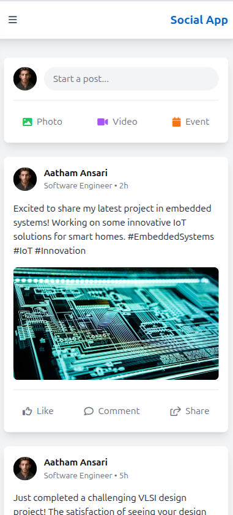
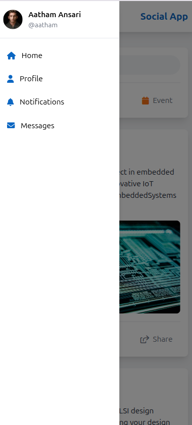

# Day 10: Navigation System

## 🎯 Goal

Develop the Comprehensive Navigation System (mobile hamburger, tablet, desktop horizontal) and integrate with existing features.

## 📚 Learning Outcomes

- Create responsive navigation components.
- Implement different navigation patterns.
- Design mobile-first navigation.
- Handle navigation state.
- Create smooth transitions.
- Implement accessibility features.

## 🚀 Getting Started

Ensure your Day 9 Feed Interactions is complete and tested. You should understand responsive design and React Router. The backend and frontend should be set up and running.

## 🛠️ Tasks

1.  **Create and Switch to a New Branch**

    > **IMPORTANT:** Always create a new branch for each distinct piece of work.

    ```bash
    # First, ensure you are on your 'master' branch and it's up-to-date
    git checkout master
    git pull origin master  # Get any potential updates from your own fork's master

    # Now, create and switch to a new branch for this day's assignment/feature
    git checkout -b day-10-navigation-system
    ```

    > **What's happening?** You're creating an independent line of development for this day's tasks.

2.  **Set Up Development Environment**

    - **Backend Virtual Environment (if not already active):**
      ```bash
      cd backend
      source venv/bin/activate  # On Windows use: venv\Scripts\activate
      ```
    - **Install Additional Dependencies:**
      ```bash
      pip install Flask Flask-SQLAlchemy Flask-Migrate
      ```
    - **Frontend (already set up from previous days):**
      - Ensure your frontend directory has all Node.js dependencies installed via `npm install`.

3.  **Navigation Components (Frontend)**

    - **Create Main Navigation:**
      - Design a responsive main navigation bar component.
      - Implement a mobile hamburger menu for compact screens.
      - Create distinct navigation layouts for tablet (key features visibly accessible) and desktop (horizontal navigation bar).
      - Consider adding sub-navigation and breadcrumbs where appropriate.

4.  **Responsive Design (Frontend Styling)**

    - **Implement Breakpoints and Layouts:**
      - Set up responsive breakpoints (e.g., using Tailwind CSS) for mobile, tablet, and desktop.
      - Design the mobile-first navigation first, emphasizing the hamburger menu for smaller screens.
      - Style the tablet and desktop navigation layouts to adapt effectively to larger screen real estate.
      - Add responsive transitions and handle orientation changes for a smooth user experience.

5.  **User Experience (Frontend Interactions)**

    - **Enhance Navigation Interactions:**
      - Add smooth animations and transitions to navigation elements (e.g., menu open/close, hover effects).
      - Implement clear active and hover states for navigation links.
      - Create loading indicators and error states for any navigation-related data fetching.
      - Implement a basic feedback system for user actions within the navigation.

6.  **Run the Application**

    ```bash
    # Start the backend server (in one terminal)
    cd backend
    flask run

    # Start the frontend development server (in another terminal)
    cd frontend
    npm run dev
    ```

    The application will be available at:

    - Frontend: `http://localhost:3000`
    - Backend API: `http://localhost:5000`

7.  **Testing**

    - Test navigation across all defined breakpoints (mobile, tablet, desktop).
    - Test the entire navigation flow and ensure all links are functional and accessible.
    - Test animations and transitions for smoothness.
    - Test error handling and overall performance of the navigation system.

## 🔄 Git Workflow

1.  **Develop and Save Progress**

    ```bash
    git add .
    git commit -m "Day 10: Implement comprehensive navigation system"
    ```

2.  **Push Your Changes to Your Fork**

    ```bash
    git push -u origin day-10-navigation-system
    ```

3.  **Merge After Completion**

    ```bash
    git checkout master
    git pull origin master
    git merge day-10-navigation-system
    git push origin master
    ```

## 📸 Preview





## ✅ Deliverable

A fully responsive and accessible navigation system with:

- Mobile, tablet, and desktop layouts.
- Smooth transitions and animations.
- Proper error handling and feedback.
- Clean, documented code.
- All tests passing.
