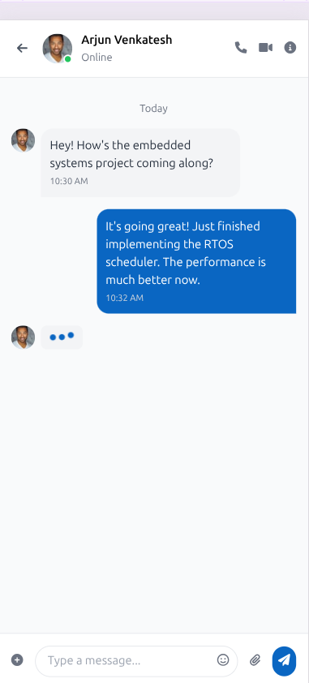
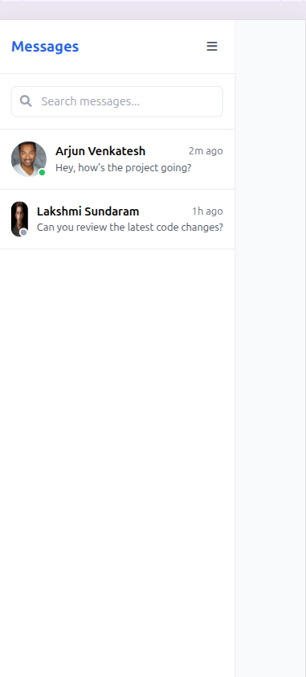

# Day 13: Messaging UI

## 🎯 Goal

Develop the Messaging UI (frontend) for basic chat functionality.

## 📚 Learning Outcomes

* Create real-time chat interface.
* Implement message components.
* Design conversation list.
* Create message input system.
* Implement typing indicators.
* Handle message states.

## 🚀 Getting Started

Ensure your Day 12 Second Deployment is complete and tested. You should understand WebSocket and real-time features. The backend and frontend should be set up and running.

## 🛠️ Tasks

1.  **Create and Switch to a New Branch**
    > **IMPORTANT:** Always create a new branch for each distinct piece of work.

    ```bash
    # First, ensure you are on your 'main' branch and it's up-to-date
    git checkout main
    git pull origin main  # Get any potential updates from your own fork's main

    # Now, create and switch to a new branch for this day's assignment/feature
    git checkout -b day-13-messaging-ui
    ```

    > **What's happening?** You're creating an independent line of development for this day's tasks.

2.  **Set Up Development Environment**
    * **Backend Virtual Environment (if not already active):**
        ```bash
        cd backend
        source venv/bin/activate  # On Windows use: venv\Scripts\activate
        ```
    * **Install Additional Dependencies:**
        ```bash
        pip install Flask-SocketIO python-socketio
        ```
    * **Frontend (already set up from previous days):**
        * Ensure your frontend directory has all Node.js dependencies installed via `npm install`.

3.  **Chat Interface (Frontend)**
    * **Create Messaging Components:**
        * Design and implement a conversation list component.
        * Create a chat window component to display messages within a conversation.
        * Add message bubble components with appropriate styling for sender and recipient.
        * Implement a message input system, including a text area and send button.
        * (Optional for tutorial context): Add emoji support for message input.
        * (Optional for tutorial context): Create file sharing functionality within the chat.

4.  **Real-time Features (Frontend & Backend)**
    * **Implement WebSocket Integration:**
        * Add typing indicators to show when another user is typing.
        * Implement read receipts for messages.
        * Create an online status system for users.
        * Add message status tracking (e.g., sent, delivered, read).
        * Implement a notification system for new messages.
        * (Optional for tutorial context): Create message search functionality.

5.  **User Experience (Frontend)**
    * **Enhance Chat Experience:**
        * Add smooth animations and transitions for messages and UI elements.
        * Create loading states and indicators for message sending/receiving.
        * Implement a robust error handling system for chat interactions.
        * (Optional for tutorial context): Add sound effects for notifications.
        * (Optional for tutorial context): Create a message action menu (e.g., for deleting or editing messages).
        * (Optional for tutorial context): Implement message reactions (e.g., emojis on messages).

6.  **Run the Application**

    ```bash
    # Start the backend server (in one terminal)
    cd backend
    flask run

    # Start the frontend development server (in another terminal)
    cd frontend
    npm run dev
    ```

    The application will be available at:

    -   Frontend: `http://localhost:3000/messages`
    -   Backend API: `http://localhost:5000`

7.  **Testing**

    * Test chat interface functionality (sending/receiving messages).
    * Test real-time features like typing indicators and online status.
    * Test message states and delivery confirmation.
    * Test file sharing capabilities (if implemented).
    * Test notification system.
    * Test responsive design of the messaging UI across devices.

## 🔄 Git Workflow

1.  **Develop and Save Your Progress**

    ```bash
    git add .
    git commit -m "Day 13: Implement messaging UI with real-time features"
    ```

2.  **Push Your Changes to Your Fork**

    ```bash
    git push -u origin day-13-messaging-ui
    ```

3.  **Merge After Completion**

    ```bash
    git checkout main
    git pull origin main
    git merge day-13-messaging-ui
    git push origin main
    ```

## 📸 Preview





## ✅ Deliverable

A fully functional messaging interface with:

* Working real-time chat.
* Complete conversation management.
* File sharing capabilities (if implemented).
* Notification system.
* Responsive design.
* Clean, documented code.
* All tests passing.

